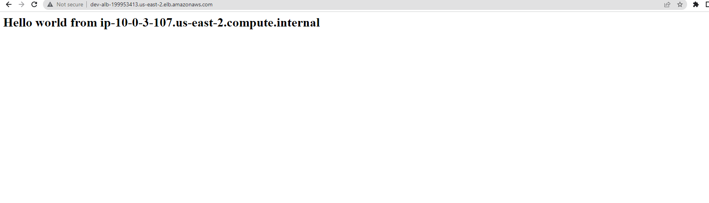

- [1. Versions used](#1-versions-used)
- [2. assumptions and prerequiste to make this terraform script to work on AWS](#2-assumptions-and-prerequiste-to-make-this-terraform-script-to-work-on-aws)
- [3. architecture implemented](#3-architecture-implemented)
- [configurations](#configurations)
  - [CIDR values in each tiers](#cidr-values-in-each-tiers)
- [test results snapshots](#test-results-snapshots)
- [terraform apply](#terraform-apply)
- [aws ALB and healthy targets](#aws-alb-and-healthy-targets)

# 1. Versions used
```

# terraform version
        Terraform v1.1.9
        on windows_amd64

# provider version
3.75.1


```


# 2. assumptions and prerequiste to make this terraform script to work on AWS
```

1. AWS admin user should be created and get configured in cli using "aws configure" command

2. I used widows mahine as terraform client. If this terraform module is downloaded to Linux to test it.
   Change the module path "source" argument correction in "env/dev/*.tf" whichever is applicable.

3. FYI - "terraform init"  performed in "env/dev/"

4. REMOTE terraform state file storage
    create S3 bucket in same region where planning to deploy with name "sun-remote-backend" 
    create dynamodb table with primary key "LockId" with table name "s3-state-lock" 

5. create ec2 key with name "dev-master-keyfile123" in same region (where going to test this module),
   which is used across for all ec2 instances in this demo.

```


# 3. architecture implemented


# configurations

## CIDR values in each tiers
[10.0.0.0/20] - CIDR
[10.0.1.0/20] - AZ1:Public/Web/Jumpserver
[10.0.2.0/24] - AZ2: Public/Web/Jumpserver
[10.0.3.0/24] - AZ1: appserver - private subnet
[10.0.4.0/24] - AZ2: appserver - private subnet
[10.0.5.0/24] - AZ1: RDS server
[10.0.6.0/24] - AZ2: RDS server 


# test results snapshots


# terraform apply


# aws ALB and healthy targets


